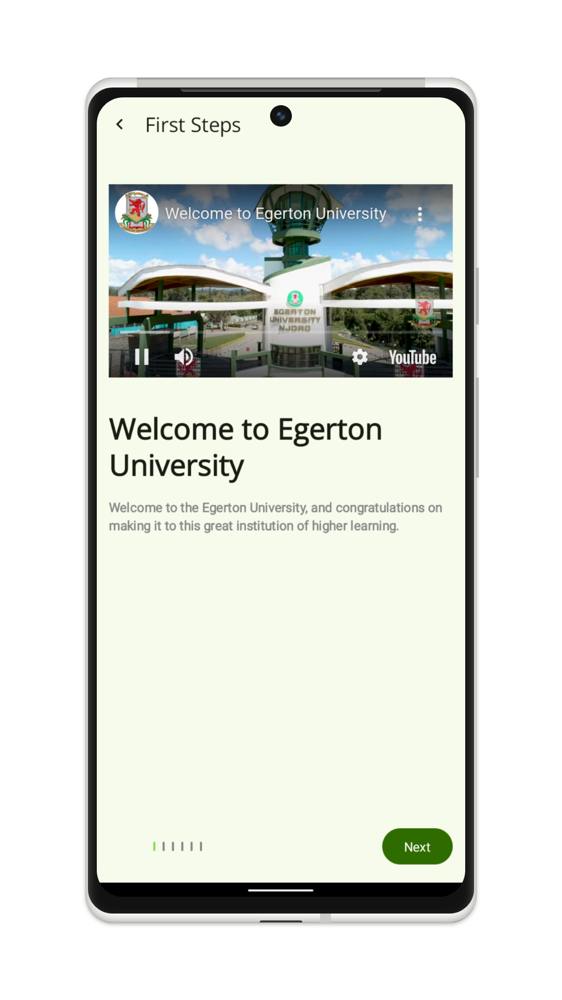
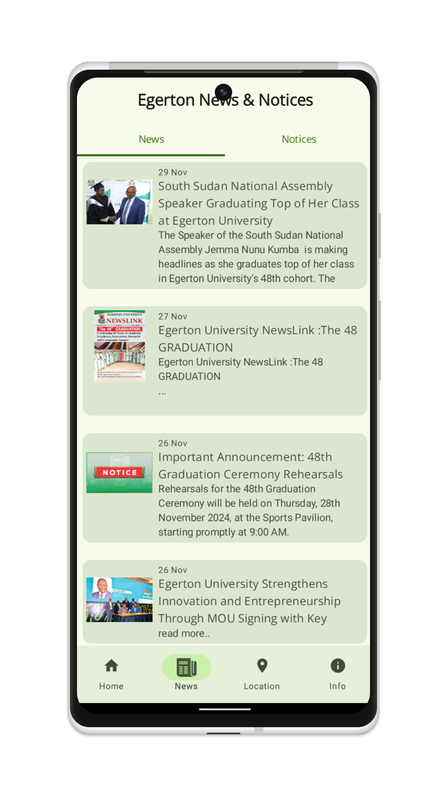
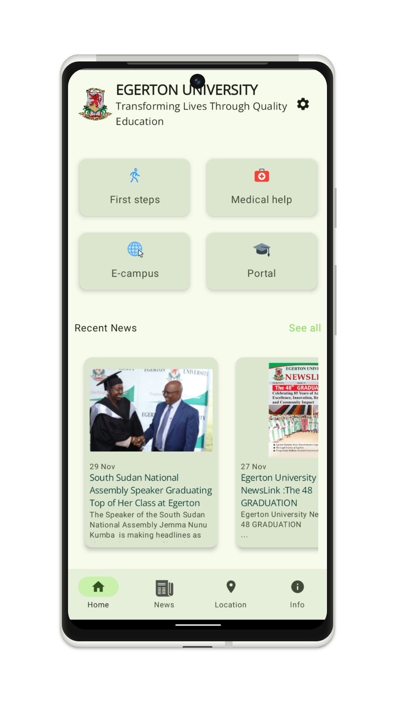
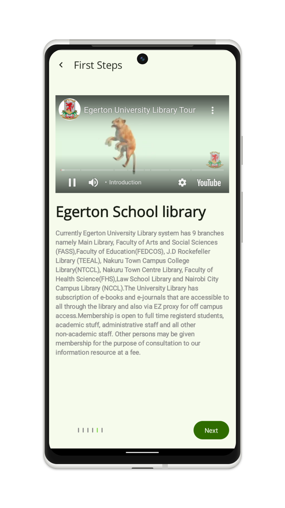
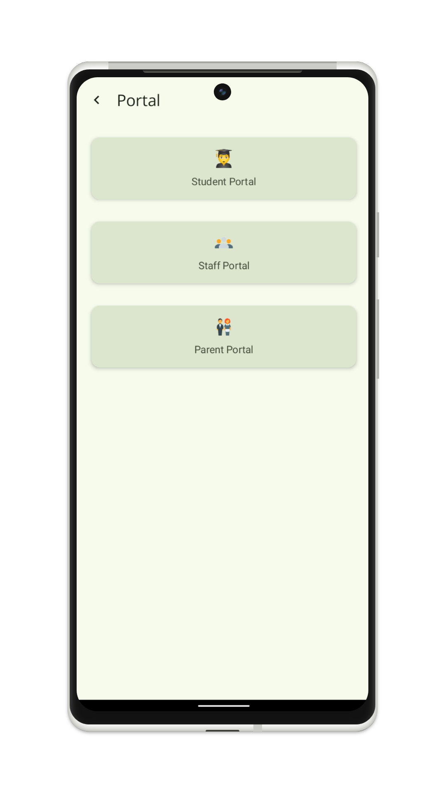
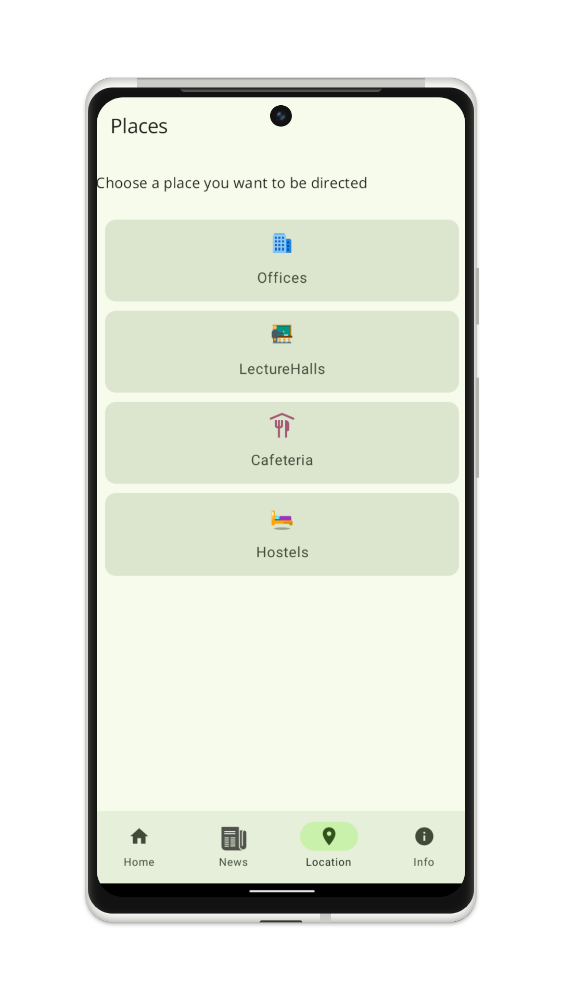

# Egerton University News App 📱📡📰

An innovative mobile application designed to keep students, staff, and other stakeholders of Egerton University informed with the latest news and updates. This app integrates **Kotlin Jetpack Compose** for the frontend, a **Python Flask scraper** for backend data acquisition, and **Firebase Cloud Messaging (FCM)** to deliver timely notifications about breaking news and events.

## 🌟 Features

### Frontend
- Developed using **Kotlin Jetpack Compose** for a modern, efficient, and responsive UI.
- Seamless navigation between sections like news, events, and other university-related updates.
- Integrated top bar with Egerton University branding.

### Backend
- **Python Flask Scraper** to fetch news and updates from Egerton University's website dynamically.
- Processed data stored securely on **Cloud Firestore** for scalability and real-time access.

### Notifications
- **Firebase Cloud Messaging (FCM)** server to send notifications directly to users about the latest news and announcements.

### News Management
- Display news cards with images, titles, and publication dates.
- Handle network errors gracefully with a Snackbar for better user experience.

## 📸 App Screenshots

| FirstSteps Screen                      | News Section                   | Home Screen                   |
|----------------------------------|--------------------------------|---------------------------------|
|  |  |  |
| library Screen                      | portal Section                   | location Screen                   |
|----------------------------------|--------------------------------|---------------------------------|
|  |  |  |

